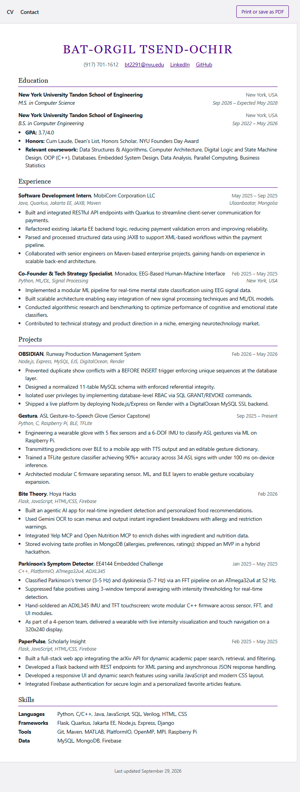

# Django CV Site

My CV built as a small Django project. All CV content lives in the view as
Python data, and the page is rendered with Django templates.

## Django template features used

- Template inheritance with `` and ``
- Reusable partials with ``, including `with` to pass variables
- `` loops for education, experience, projects, and skills
- `` for optional fields such as GPA and ongoing roles
- Filters: `|date`, `|join`, `|upper`
- `` for the stylesheet
- `` for internal navigation between pages

## Tech

Python, Django, HTML, CSS (with a print stylesheet for PDF export)

## Run locally (Windows)

```
python -m venv venv
venv\Scripts\activate
pip install -r requirements.txt
python manage.py runserver
```

Then open http://127.0.0.1:8000/

## Project structure



```
config/          project settings and root URLs
cv/views.py      CV data and views
cv/urls.py       app routes
cv/templates/cv/ base, pages, and partials
cv/static/cv/    stylesheet
```